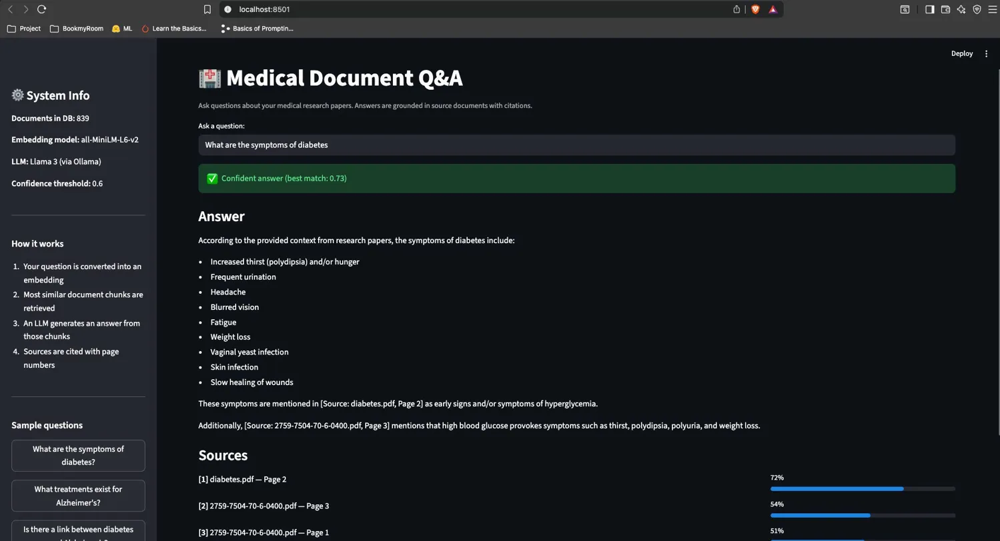
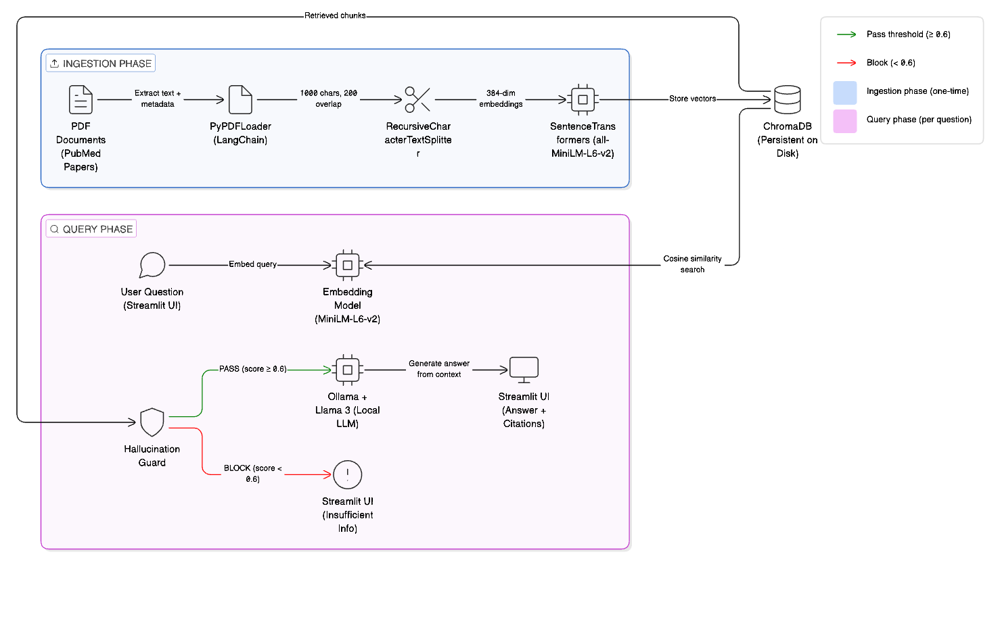

# 🏥 Medical Document Q&A — RAG System

A **Retrieval-Augmented Generation** system that answers questions about medical research papers using local LLMs. Built from scratch to demonstrate end-to-end ML engineering — from PDF ingestion to a production-ready web interface with source citations and hallucination guards.



---

## 🎯 What This Project Does

Upload medical research papers (PDFs), and the system lets you ask natural language questions about them. Instead of reading 100+ pages, you get concise answers grounded in the source text — with exact page citations so you can verify every claim.

**Example:**

> **Q:** What are the symptoms of diabetes?
>
> **A:** According to the provided context, symptoms of diabetes include increased thirst (polydipsia), frequent urination, headache, blurred vision, fatigue, and weight loss. These symptoms are mentioned in [Source: diabetes.pdf, Page 2] as early signs of hyperglycemia.
>
> **Sources:** diabetes.pdf Page 2 (72%) · 2759-7504-70-6-0400.pdf Page 3 (54%)

---

## 🏗 Architecture



---

## ✨ Key Features

- **Source Citations** — Every answer shows the exact PDF filename, page number, and confidence score
- **Hallucination Guard** — Refuses to answer when retrieved chunks score below 0.6 similarity, preventing fabricated responses
- **Fully Local** — No API keys, no cloud services, no data leaves your machine (Ollama + Llama 3)
- **Persistent Storage** — ChromaDB stores embeddings on disk; no need to reprocess PDFs after initial setup
- **Interactive UI** — Streamlit web app with sample questions, confidence indicators, and visual source bars

---

## 🛠 Tech Stack

| Component | Technology | Why |
|-----------|-----------|-----|
| Document Loading | LangChain + PyPDF | Extracts text + metadata from PDFs |
| Text Splitting | RecursiveCharacterTextSplitter | Splits at paragraph boundaries, preserves context |
| Embeddings | SentenceTransformers (all-MiniLM-L6-v2) | Fast, lightweight, 384-dim vectors |
| Vector Store | ChromaDB | Local, persistent, cosine similarity built-in |
| LLM | Ollama + Llama 3 | Free, local, no API key needed |
| Web UI | Streamlit | Quick to build, clean interface |
| Language | Python 3.9+ | |

---

## 🚀 Quick Start

### Prerequisites

- Python 3.9+
- [Ollama](https://ollama.com) installed
- ~6GB disk space (for Llama 3 model)

### Setup

```bash
# Clone the repo
git clone https://github.com/RaghulPrasath-Here/medical-RAG.git
cd medical-RAG

# Install dependencies
pip3 install -r requirements.txt

# Download the LLM
ollama pull llama3
```

### Add Your Documents

Download free medical papers from [PubMed Central](https://pmc.ncbi.nlm.nih.gov/) and place the PDFs in the `documents/` folder. Sample papers used in this project:

1. [Diabetes Type 1 & 2 Management Review](https://pmc.ncbi.nlm.nih.gov/articles/PMC11527681/)
2. [Up-to-date Diabetes Treatment](https://pmc.ncbi.nlm.nih.gov/articles/PMC11745827/)
3. [Alzheimer's Disease: Diagnosis & Therapeutics](https://pmc.ncbi.nlm.nih.gov/articles/PMC11341404/)
4. [Alzheimer's Disease: Comprehensive Review](https://pmc.ncbi.nlm.nih.gov/articles/PMC11682909/)
5. [Alzheimer's Therapies & Prevention](https://pmc.ncbi.nlm.nih.gov/articles/PMC11097689/)

### Run the Pipeline

Run the Jupyter notebook `RAG_Pipe.ipynb` from top to bottom to process the documents and build the vector store.

### Launch the Web App

```bash
# Start Ollama in one terminal
ollama serve

# Start the app in another terminal
streamlit run app.py
```

Open `http://localhost:8501` in your browser.

---

## 📊 Evaluation Results

Tested on 10 curated questions (8 in-scope, 2 out-of-scope):

| Metric | Score |
|--------|-------|
| Hallucination guard accuracy | 100% |
| Retrieval accuracy | 90% |
| Answer faithfulness (keyword match) | 85% |
| Avg response time | ~5s |

---

## 📁 Project Structure

```
medical-RAG/
├── app.py                  # Streamlit web interface
├── RAG_Pipe.ipynb          # Full pipeline notebook (Steps 2-11)
├── requirements.txt        # Python dependencies
├── documents/              # PDF papers (not tracked in git)
├── chroma_db/              # Vector store (auto-generated)
├── screenshots/            # App screenshots for README
│   └── demo.png
└── README.md
```

---

## 🧠 Design Decisions & Trade-offs

**Chunk size of 1000 characters** — Medical papers have dense paragraphs. Smaller chunks (200-500) lost context; larger chunks (2000+) reduced retrieval precision. 1000 chars ≈ 1-2 paragraphs balances both.

**Cosine similarity over Euclidean distance** — Cosine measures the angle between vectors regardless of magnitude. Two chunks about "insulin treatment" will be similar even if one is longer. Euclidean distance would penalize length differences.

**Temperature 0.3 for the LLM** — Medical Q&A demands factual accuracy. Low temperature keeps the LLM close to the source text instead of generating creative but potentially wrong responses.

**Threshold of 0.6 for hallucination guard** — Empirically chosen: in-scope queries score 0.5–0.75, out-of-scope queries score 0.1–0.3. The 0.6 threshold catches obvious out-of-scope questions while allowing borderline medical queries through.

---

## ⚠️ Limitations & Future Improvements

- **Query phrasing sensitivity** — "How is diabetes diagnosed?" retrieves different chunks than "diagnosis criteria HbA1c." Query expansion or HyDE (Hypothetical Document Embeddings) would help.
- **Table/figure extraction** — PyPDF extracts text only. Tables in PDFs become garbled text. A layout-aware parser (like Unstructured or DocTR) would improve this.
- **No multi-turn conversation** — Each question is independent. Adding conversation memory would allow follow-up questions like "Tell me more about that treatment."
- **Single embedding model** — all-MiniLM-L6-v2 is general-purpose. A medical-domain model like PubMedBERT embeddings could improve retrieval for clinical terminology.
- **Basic evaluation** — Keyword matching is a rough proxy for faithfulness. A more rigorous evaluation would use LLM-as-judge or human annotation.

---

## 📚 What I Learned

- How embedding models capture semantic meaning (not just keyword matching)
- Why chunk size and overlap directly impact retrieval quality
- The importance of prompt engineering for grounding LLM responses
- How to build a hallucination guard using similarity score thresholds
- End-to-end system design from data ingestion to user interface


